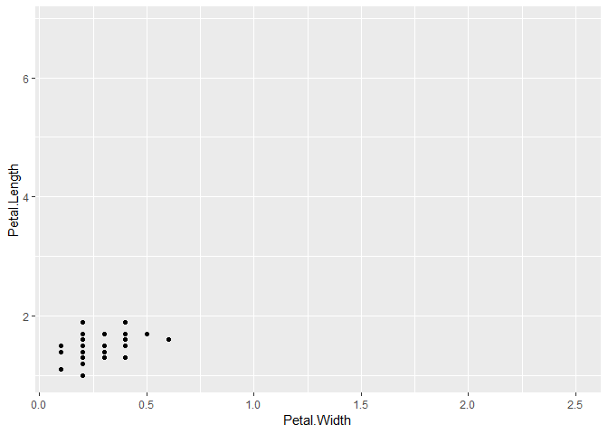
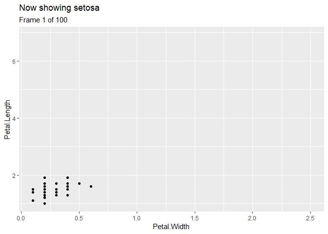
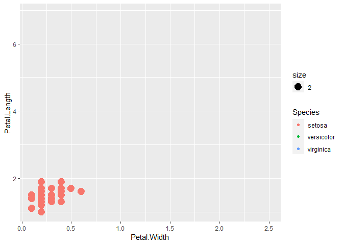

gganimate: Your data can dance
================
Wei Liu
10/25/2021

## What??? :confused:

**gganimate** is an extension of the ggplot2 package for creating
animated ggplots. It provides a range of new functionality that can be
added to the plot object in order to customize how it should change with
time.

<center>

</center>

## Who??? :open\_mouth:

#### Thomas Lin Pedersen \[aut, cre\]

<center>

</center>

> I am a *food scientist* turned *bioinformatician* and *data
> scientist*. My professional goal is to create tools that let
> researchers connect with their data in a deeper and more meaningful
> way, through visualisations, frameworks and user interfaces.

#### Education

-   **Danmarks Tekniske Universitet**  
      PhD, Bioinformatics, 2012 – 2016
-   **Københavns Universitet**  
      MSc, Food Science and Technology, 2009 – 2011
-   **Københavns Universitet**  
      Bachelor, Food Science and Technology, 2005 – 2008

<center>

</center>

#### Experience

-   **Software Engineer**  
      RStudio, Oct 2018 – present, Copenhagen Area, Denmark
-   **Data Scientist**  
      SKAT, Feb 2017 – Oct 2018, Copenhagen Area, Denmark
-   **Bioinformatics Researcher**  
      Gubra, Oct 2016 - Dec 2016, Hørsholm, Denmark

<center>

</center>

## Why??? :relieved:

-   **TRANSITION**: You want your data to *change*.
-   **SHADOW**: You want your data to have *memory*.
-   **VIEW**: You want your data to tell *stories*.

## How??? :smiley:

### Basic Functions

Before jumping to specific examples, here are two basic functions in
gganimate that need introducing.  

-   **transition\_\*()**   It defines how the data should be spread out
    and how it relates to itself across time.  
-   **ease\_aes()**   It defines how different aesthetics should be
    eased during transitions.  

### Examples

#### :one: Start with a static plot

In this part, we will first create a static plot with the dataset,
*iris*, using the ggplot() function. And in the following steps, we will
add several animation features to this original plot.  
(The packages of ggplot2 and gganimate have already been loaded in the
environment.)

``` r
str(iris) # Here is the structure of iris dataset (in case you don't remember.)
```

    ## 'data.frame':    150 obs. of  5 variables:
    ##  $ Sepal.Length: num  5.1 4.9 4.7 4.6 5 5.4 4.6 5 4.4 4.9 ...
    ##  $ Sepal.Width : num  3.5 3 3.2 3.1 3.6 3.9 3.4 3.4 2.9 3.1 ...
    ##  $ Petal.Length: num  1.4 1.4 1.3 1.5 1.4 1.7 1.4 1.5 1.4 1.5 ...
    ##  $ Petal.Width : num  0.2 0.2 0.2 0.2 0.2 0.4 0.3 0.2 0.2 0.1 ...
    ##  $ Species     : Factor w/ 3 levels "setosa","versicolor",..: 1 1 1 1 1 1 1 1 1 1 ...

``` r
p <- ggplot(iris, aes(x=Petal.Width, y=Petal.Length)) +
  geom_point()
plot(p)
```


#### :two: Add transitions

There are a number of options for us to select (shown in the table below
:arrow\_down:).  

|   Function Name    | Brief Description                                               |
|:------------------:|-----------------------------------------------------------------|
| transition\_states | Transition between several distinct stages of the data          |
|  transition\_time  | Transition through distinct states in time                      |
| transition\_filter | Transition between different filters                            |
| transition\_events | Transition individual events in and out                         |
| transition\_manual | Create an animation by specifying the frame membership directly |
| transition\_reveal | Reveal data along a given dimension                             |
|         …          | …                                                               |

But, to make it straightforward, in this part, we only take
**transition\_states()** function for example. :sparkles:

``` r
anim1 <- p +
  transition_states(Species,
                    transition_length=2,
                    state_length=1)
anim1
```

<!-- -->

#### :three: Control easing of aesthetics

In this part, we will use the **ease\_aes()** funtion.  

Easing defines how a value change to another during tweening. Will it
progress linearly, or maybe start slowly and then build up momentum.  

When setting nothing in ease\_aes(), the default animation will be built
with a linear model, like what we have in part two.  

There are many animation type available (shown in the table below
:arrow\_down:).

| Easing function | Brief Description                   |
|:---------------:|-------------------------------------|
|    quadratic    | Models a power-of-2 function        |
|      cubic      | Models a power-of-3 function        |
|      sine       | Models a sine function              |
|   exponential   | Models an exponential function      |
|     elastic     | Models an elastic release of energy |
|     bounce      | Models the bouncing of a ball       |
|        …        | …                                   |

When deciding the easing type, we also choose certain modifier for the
animation. :arrow\_down:

| Modifier | Brief Description                                                                           |
|:--------:|---------------------------------------------------------------------------------------------|
|   -in    | The easing function is applied as-is                                                        |
|   -out   | The easing function is applied in reverse                                                   |
| -in-out  | The first half of the transition it is applied as-is, while in the last half it is reversed |

Then we need an example to make it clear. :sparkles:

``` r
anim1 +
  ease_aes('sine-out')
```


Try another option… :sparkles:

``` r
anim1 +
  ease_aes(y='bounce-in') # Bouncing~~~ But only want them to bounce vetically.
```


#### :four: Add titles and subtitles

gganimate use similar grammar like ggplot when defining the titles, but
there are some differences. Let’s see. :sparkles:

``` r
anim1 +
  ease_aes(y='bounce-in') +
  ggtitle("Now showing {closest_state}",
          subtitle="Frame {frame} of {nframes}")
```

<!-- -->

-   *What is a frame? And nframes?* Every time when we do the rendering,
    it is the default manner of the code to create 100 frames, or you
    can say, 100 plots.

#### :five: Other useful functions

Still, there’s more to find out about gganimate.  

-   **enter\_\*()** and **exit\_\*()** to control what happens with data
    that does not persist during a tween. In general the non-persistent
    data is transformed to an invisible version that can be tweened to,
    e.g. by setting the opacity to 0.

If preferred, here is an example for enter\_\*() and exit\_\*() .
:sparkles:

``` r
anim2 <- ggplot(iris, aes(x=Petal.Width, y=Petal.Length,
                          color=Species, size=2)) +
  geom_point() +
  transition_states(Species,
                    transition_length=2,
                    state_length=1)

# The states are so different since we color the points by Species, 
# it will be confused for our code to understand how to change from one state to another, 
# so it will be better if we simply tell it how.

anim2 +
  enter_fade() +
  exit_shrink()
```



  

-   **anim\_save()** to save your GIF file to your own computer, using
    similar grammar like ggsave().  

## References

1.  [CRAN - ggnimate
    package](https://CRAN.R-project.org/package=gganimate)
2.  [Reference manual for
    gganimate](https://cran.r-project.org/web/packages/gganimate/gganimate.pdf)
3.  [GitHub - Thomas Lin Pedersen -
    gganimate](https://github.com/thomasp85/gganimate)
4.  [TED Talk - Rosling the Best Stats You’ve Ever
    Seen](https://www.ted.com/talks/hans_rosling_the_best_stats_you_ve_ever_seen/transcript?language=zh-TW)
5.  [gganimate: How to create plots with beautiful animation in
    R](https://www.datanovia.com/en/blog/gganimate-how-to-create-plots-with-beautiful-animation-in-r/)
6.  [How to use gganimate in
    R](https://www.youtube.com/watch?v=ccuZYgcwusU)
7.  [Google Scholar - Thomas Lin
    Pedersen](https://scholar.google.com/citations?user=iiao_f4AAAAJ&hl=en)
8.  [LinkedIn - Thomas Lin
    Pedersen](https://www.linkedin.com/in/thomasp85/)
9.  [Interview with Thomas Lin
    Pederson](https://user2018.r-project.org/blog/2018/04/18/interview-with-thomas-lin-pedersen/)
10. [What is
    “tween/tweening”?](https://www.webopedia.com/definitions/tweening/)
