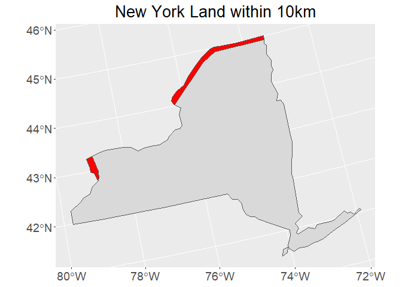

Case Study 05: Beware the Canadians!
================
Wei Liu
October 6, 2021

## Activate the packages that we need

``` r
library(spData)
library(sf)
library(tidyverse)
library(units)
```

## Load the data and explore a bit

dataset of world

``` r
data(world)
st_crs(world) # show the coordinate reference system of world dataset
```

    ## Coordinate Reference System:
    ##   User input: EPSG:4326 
    ##   wkt:
    ## GEOGCRS["WGS 84",
    ##     DATUM["World Geodetic System 1984",
    ##         ELLIPSOID["WGS 84",6378137,298.257223563,
    ##             LENGTHUNIT["metre",1]]],
    ##     PRIMEM["Greenwich",0,
    ##         ANGLEUNIT["degree",0.0174532925199433]],
    ##     CS[ellipsoidal,2],
    ##         AXIS["geodetic latitude (Lat)",north,
    ##             ORDER[1],
    ##             ANGLEUNIT["degree",0.0174532925199433]],
    ##         AXIS["geodetic longitude (Lon)",east,
    ##             ORDER[2],
    ##             ANGLEUNIT["degree",0.0174532925199433]],
    ##     USAGE[
    ##         SCOPE["Horizontal component of 3D system."],
    ##         AREA["World."],
    ##         BBOX[-90,-180,90,180]],
    ##     ID["EPSG",4326]]

``` r
head(world)
```

    ## Simple feature collection with 6 features and 10 fields
    ## Geometry type: MULTIPOLYGON
    ## Dimension:     XY
    ## Bounding box:  xmin: -180 ymin: -18.28799 xmax: 180 ymax: 83.23324
    ## Geodetic CRS:  WGS 84
    ## # A tibble: 6 x 11
    ##   iso_a2 name_long  continent region_un subregion type  area_km2     pop lifeExp
    ##   <chr>  <chr>      <chr>     <chr>     <chr>     <chr>    <dbl>   <dbl>   <dbl>
    ## 1 FJ     Fiji       Oceania   Oceania   Melanesia Sove~   1.93e4  8.86e5    70.0
    ## 2 TZ     Tanzania   Africa    Africa    Eastern ~ Sove~   9.33e5  5.22e7    64.2
    ## 3 EH     Western S~ Africa    Africa    Northern~ Inde~   9.63e4 NA         NA  
    ## 4 CA     Canada     North Am~ Americas  Northern~ Sove~   1.00e7  3.55e7    82.0
    ## 5 US     United St~ North Am~ Americas  Northern~ Coun~   9.51e6  3.19e8    78.8
    ## 6 KZ     Kazakhstan Asia      Asia      Central ~ Sove~   2.73e6  1.73e7    71.6
    ## # ... with 2 more variables: gdpPercap <dbl>, geom <MULTIPOLYGON [°]>

dataset of us\_states

``` r
data(us_states)
st_crs(us_states)
```

    ## Coordinate Reference System:
    ##   User input: EPSG:4269 
    ##   wkt:
    ## GEOGCS["NAD83",
    ##     DATUM["North_American_Datum_1983",
    ##         SPHEROID["GRS 1980",6378137,298.257222101,
    ##             AUTHORITY["EPSG","7019"]],
    ##         TOWGS84[0,0,0,0,0,0,0],
    ##         AUTHORITY["EPSG","6269"]],
    ##     PRIMEM["Greenwich",0,
    ##         AUTHORITY["EPSG","8901"]],
    ##     UNIT["degree",0.0174532925199433,
    ##         AUTHORITY["EPSG","9122"]],
    ##     AUTHORITY["EPSG","4269"]]

``` r
head(us_states)
```

    ## Simple feature collection with 6 features and 6 fields
    ## Geometry type: MULTIPOLYGON
    ## Dimension:     XY
    ## Bounding box:  xmin: -114.8136 ymin: 24.55868 xmax: -71.78699 ymax: 42.04964
    ## Geodetic CRS:  NAD83
    ##   GEOID        NAME   REGION             AREA total_pop_10 total_pop_15
    ## 1    01     Alabama    South 133709.27 [km^2]      4712651      4830620
    ## 2    04     Arizona     West 295281.25 [km^2]      6246816      6641928
    ## 3    08    Colorado     West 269573.06 [km^2]      4887061      5278906
    ## 4    09 Connecticut Norteast  12976.59 [km^2]      3545837      3593222
    ## 5    12     Florida    South 151052.01 [km^2]     18511620     19645772
    ## 6    13     Georgia    South 152725.21 [km^2]      9468815     10006693
    ##                         geometry
    ## 1 MULTIPOLYGON (((-88.20006 3...
    ## 2 MULTIPOLYGON (((-114.7196 3...
    ## 3 MULTIPOLYGON (((-109.0501 4...
    ## 4 MULTIPOLYGON (((-73.48731 4...
    ## 5 MULTIPOLYGON (((-81.81169 2...
    ## 6 MULTIPOLYGON (((-85.60516 3...

## Prepare the data for buffering

Filter the world and us\_states dataset to keep only “Canada” and “New
York” respectively.

``` r
Canada = filter(world, name_long=="Canada")
NY = filter(us_states, NAME=="New York")
```

Transform to the albers equal area projection defined below as albers.

``` r
albers="+proj=aea +lat_1=29.5 +lat_2=45.5 +lat_0=37.5 +lon_0=-96 +x_0=0 +y_0=0 +ellps=GRS80 +datum=NAD83 +units=m +no_defs"
Canada_trans = st_transform(Canada, crs=albers)
NY_trans = st_transform(NY, crs=albers)
```

## Buffer, intersection and area

``` r
Canada_buffer = st_buffer(Canada_trans, dist=10000) # The default unit is meter.
border = st_intersection(Canada_buffer, NY_trans)
st_area(border) %>% set_units(km^2)
```

    ## 3495.19 [km^2]

## Plot out the border area

``` r
ggplot() +
  geom_sf(data=NY_trans, fill="grey85") +
  geom_sf(data=border, fill="red") +
  labs(title="New York Land within 10km") +
  theme(plot.title = element_text(size=20L, hjust=0.5),
        axis.text = element_text(size=14L))
```


