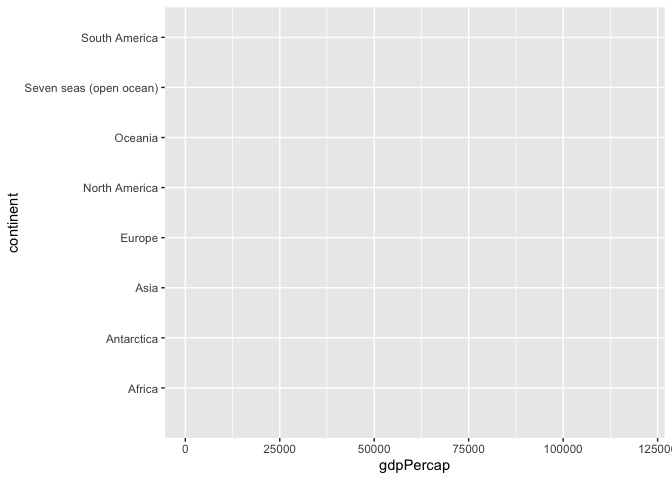
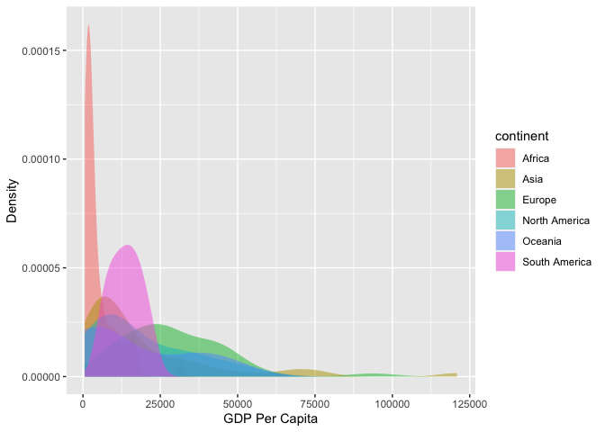

Case Study 07: Getting Help!
================
Wei Liu
August 1, 2020

## Current version of my code

There is some error.

``` r
library(tidyverse)
library(reprex)
library(sf)
library(spData)

data(world)

ggplot(world,aes(x=gdpPercap, y=continent, color=continent))+
  geom_density(alpha=0.5,color=F)
```

    ## Warning: Removed 17 rows containing non-finite values (stat_density).

<!-- -->

We need to copy the all the lines above.

## Generate the reproducible example

``` r
reprex(venue="gh")
```

## Post a new issue on GitHub

Since the reprex content is already on the clipboard, just paste the
reprex in the “leave a comment” box.

# Corrected Code

``` r
library(tidyverse)
library(reprex)
library(sf)

library(spData)
data(world)

ggplot(world,aes(x=gdpPercap, color=continent, fill=continent)) +
  geom_density(alpha=0.5,color=F) +
  xlab("GDP Per Capita") +
  ylab("Density")
```

    ## Warning: Removed 17 rows containing non-finite values (stat_density).

<!-- -->
