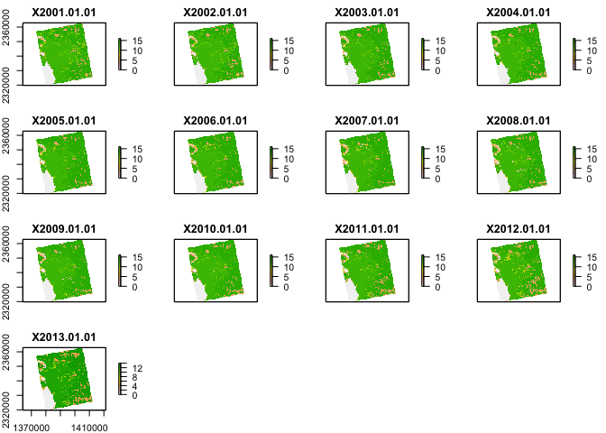
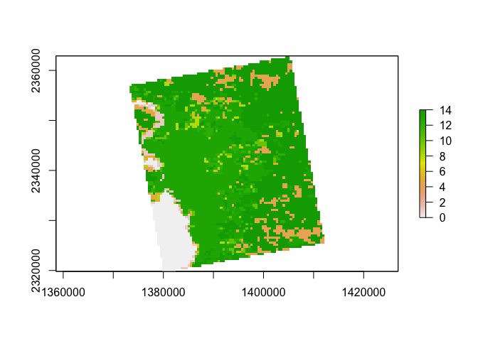
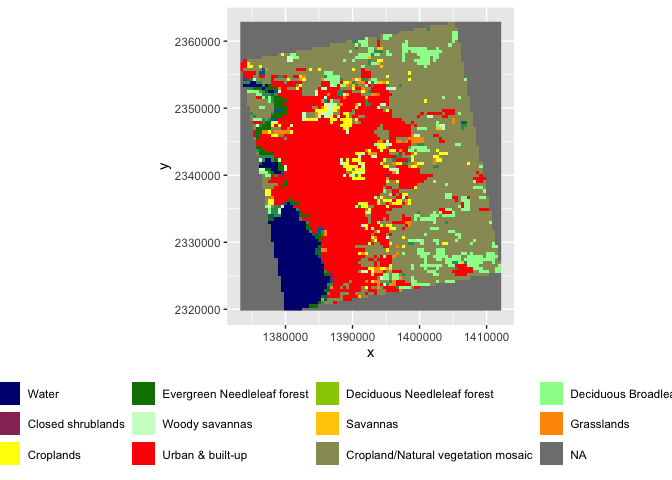
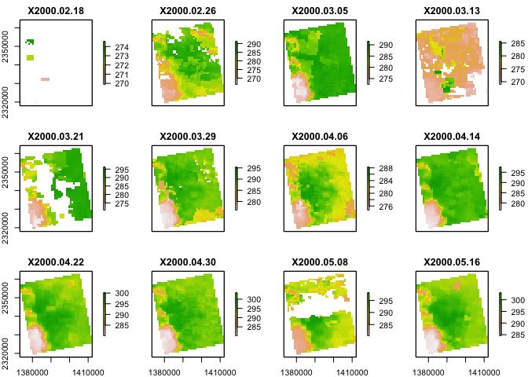
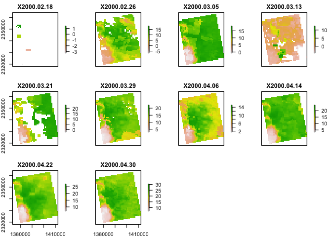
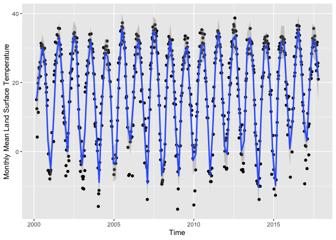
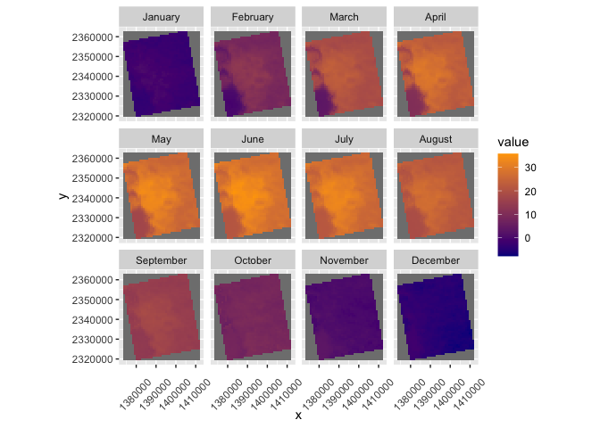

Case Study 10: Satellite Remote Sensing
================
Wei Liu
November 10, 2021

## Load needed libraries

``` r
library(raster)
library(rasterVis)
library(rgdal)
library(ggmap)
library(tidyverse)
library(knitr)
library(ncdf4) # to import data from netcdf format
```

## Prepare the data

### Download the data

``` r
# Create afolder to hold the downloaded data
dir.create("data",showWarnings = F) #create a folder to hold the data

lulc_url="https://github.com/adammwilson/DataScienceData/blob/master/inst/extdata/appeears/MCD12Q1.051_aid0001.nc?raw=true"
lst_url="https://github.com/adammwilson/DataScienceData/blob/master/inst/extdata/appeears/MOD11A2.006_aid0001.nc?raw=true"

# download them
download.file(lulc_url,destfile="data/MCD12Q1.051_aid0001.nc", mode="wb")
download.file(lst_url,destfile="data/MOD11A2.006_aid0001.nc", mode="wb")
```

### Load data into R

``` r
lulc=stack("data/MCD12Q1.051_aid0001.nc",varname="Land_Cover_Type_1")
```

    ## [1] ">>>> WARNING <<<  attribute latitude_of_projection_origin is an 8-byte value, but R"
    ## [1] "does not support this data type. I am returning a double precision"
    ## [1] "floating point, but you must be aware that this could lose precision!"
    ## [1] ">>>> WARNING <<<  attribute longitude_of_central_meridian is an 8-byte value, but R"
    ## [1] "does not support this data type. I am returning a double precision"
    ## [1] "floating point, but you must be aware that this could lose precision!"
    ## [1] ">>>> WARNING <<<  attribute longitude_of_projection_origin is an 8-byte value, but R"
    ## [1] "does not support this data type. I am returning a double precision"
    ## [1] "floating point, but you must be aware that this could lose precision!"
    ## [1] ">>>> WARNING <<<  attribute straight_vertical_longitude_from_pole is an 8-byte value, but R"
    ## [1] "does not support this data type. I am returning a double precision"
    ## [1] "floating point, but you must be aware that this could lose precision!"
    ## [1] ">>>> WARNING <<<  attribute false_easting is an 8-byte value, but R"
    ## [1] "does not support this data type. I am returning a double precision"
    ## [1] "floating point, but you must be aware that this could lose precision!"
    ## [1] ">>>> WARNING <<<  attribute false_northing is an 8-byte value, but R"
    ## [1] "does not support this data type. I am returning a double precision"
    ## [1] "floating point, but you must be aware that this could lose precision!"

``` r
lst=stack("data/MOD11A2.006_aid0001.nc",varname="LST_Day_1km")
```

    ## [1] ">>>> WARNING <<<  attribute latitude_of_projection_origin is an 8-byte value, but R"
    ## [1] "does not support this data type. I am returning a double precision"
    ## [1] "floating point, but you must be aware that this could lose precision!"
    ## [1] ">>>> WARNING <<<  attribute longitude_of_central_meridian is an 8-byte value, but R"
    ## [1] "does not support this data type. I am returning a double precision"
    ## [1] "floating point, but you must be aware that this could lose precision!"
    ## [1] ">>>> WARNING <<<  attribute longitude_of_projection_origin is an 8-byte value, but R"
    ## [1] "does not support this data type. I am returning a double precision"
    ## [1] "floating point, but you must be aware that this could lose precision!"
    ## [1] ">>>> WARNING <<<  attribute straight_vertical_longitude_from_pole is an 8-byte value, but R"
    ## [1] "does not support this data type. I am returning a double precision"
    ## [1] "floating point, but you must be aware that this could lose precision!"
    ## [1] ">>>> WARNING <<<  attribute false_easting is an 8-byte value, but R"
    ## [1] "does not support this data type. I am returning a double precision"
    ## [1] "floating point, but you must be aware that this could lose precision!"
    ## [1] ">>>> WARNING <<<  attribute false_northing is an 8-byte value, but R"
    ## [1] "does not support this data type. I am returning a double precision"
    ## [1] "floating point, but you must be aware that this could lose precision!"

### Explore LULC data

``` r
plot(lulc)
```



``` r
# pick one year to work with
lulc=lulc[[13]]
plot(lulc)
```



### Process land cover data

``` r
Land_Cover_Type_1 = c(
  Water = 0, 
  `Evergreen Needleleaf forest` = 1, 
  `Evergreen Broadleaf forest` = 2,
  `Deciduous Needleleaf forest` = 3, 
  `Deciduous Broadleaf forest` = 4,
  `Mixed forest` = 5, 
  `Closed shrublands` = 6,
  `Open shrublands` = 7,
  `Woody savannas` = 8, 
  Savannas = 9,
  Grasslands = 10,
  `Permanent wetlands` = 11, 
  Croplands = 12,
  `Urban & built-up` = 13,
  `Cropland/Natural vegetation mosaic` = 14, 
  `Snow & ice` = 15,
  `Barren/Sparsely vegetated` = 16, 
  Unclassified = 254,
  NoDataFill = 255)
```

``` r
lcd=data.frame(
  ID=Land_Cover_Type_1,
  landcover=names(Land_Cover_Type_1),
  col=c("#000080","#008000","#00FF00", "#99CC00","#99FF99", "#339966", "#993366", "#FFCC99", "#CCFFCC", "#FFCC00", "#FF9900", "#006699", "#FFFF00", "#FF0000", "#999966", "#FFFFFF", "#808080", "#000000", "#000000"),
  stringsAsFactors = F)
# colors from https://lpdaac.usgs.gov/about/news_archive/modisterra_land_cover_types_yearly_l3_global_005deg_cmg_mod12c1
kable(head(lcd))
```

|                             |  ID | landcover                   | col     |
|:----------------------------|----:|:----------------------------|:--------|
| Water                       |   0 | Water                       | #000080 |
| Evergreen Needleleaf forest |   1 | Evergreen Needleleaf forest | #008000 |
| Evergreen Broadleaf forest  |   2 | Evergreen Broadleaf forest  | #00FF00 |
| Deciduous Needleleaf forest |   3 | Deciduous Needleleaf forest | #99CC00 |
| Deciduous Broadleaf forest  |   4 | Deciduous Broadleaf forest  | #99FF99 |
| Mixed forest                |   5 | Mixed forest                | #339966 |

``` r
# convert to raster (easy)
lulc=as.factor(lulc)
# update the RAT with a left join
levels(lulc)=left_join(levels(lulc)[[1]],lcd)
```

### Plot LULC data

``` r
gplot(lulc)+
  geom_raster(aes(fill=as.factor(value)))+
  scale_fill_manual(values=levels(lulc)[[1]]$col,
                    labels=levels(lulc)[[1]]$landcover,
                    name="Landcover Type")+
  coord_equal()+
  theme(legend.position = "bottom")+
  guides(fill=guide_legend(ncol=5, nrow=3, byrow=TRUE))
```

<!-- -->

### Plot land surface temperature

``` r
plot(lst[[1:12]])
```

<!-- -->

### Convert LST to Degrees C

``` r
offs(lst)=-273.15
plot(lst[[1:10]])
```

<!-- -->

### Add Dates to Z (time) dimension

``` r
names(lst)[1:5]
```

    ## [1] "X2000.02.18" "X2000.02.26" "X2000.03.05" "X2000.03.13" "X2000.03.21"

``` r
tdates=names(lst)%>%
  sub(pattern="X",replacement="")%>%
  as.Date("%Y.%m.%d")

names(lst)=1:nlayers(lst)
lst=setZ(lst,tdates)
```

## Part 1: Extract timeseries for a point

Extract LST values for a single point and plot them.

``` r
lw=SpatialPoints(data.frame(x= -78.791547,y=43.007211))
projection(lw) <- "+proj=longlat"
lw_transformed = spTransform(lw, crs(lst))
lst_data = raster::extract(lst,lw_transformed,buffer=1000,fun=mean,na.rm=T)
lst_data_transposed = t(lst_data)
dates = getZ(lst)
dates_lst = data.frame(date = dates, lst = lst_data_transposed)

ggplot(dates_lst, aes(date, lst)) +
  geom_point() +
  geom_smooth(span=0.01, n=100) +
  labs(x = "Time",
       y = "Monthly Mean Land Surface Temperature")
```

<!-- -->

## Part 2: Summarize weekly data to monthly climatologies

``` r
tmonth = as.numeric(format(getZ(lst),"%m"))
lst_month = stackApply(lst, tmonth, fun=mean)
names(lst_month)=month.name
```

Then we plot the map for each month.

``` r
gplot(lst_month) + 
  geom_tile(aes(fill = value)) +
  scale_fill_gradient(low = 'dark blue', high = 'orange') +
  facet_wrap(~variable) +
  coord_equal() +
  theme(axis.text.x = element_text(angle = 45, vjust = 0.3))
```

<!-- -->

Calculate the monthly mean for the entire image.

``` r
cellStats(lst_month,mean) %>% 
  as.data.frame() %>%  # Inspired by Hui
  rename(Mean = ".") %>% 
  kable()
```

|           |      Mean |
|:----------|----------:|
| January   | -2.127506 |
| February  |  8.710271 |
| March     | 18.172077 |
| April     | 23.173591 |
| May       | 26.990005 |
| June      | 28.840144 |
| July      | 27.358260 |
| August    | 22.927727 |
| September | 15.477510 |
| October   |  8.329881 |
| November  |  0.586179 |
| December  | -4.754134 |
