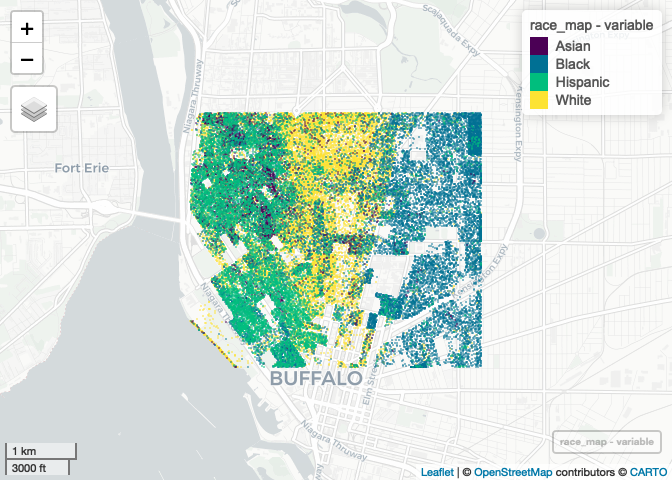

Case Study 11: Parallel Computing with R
================
Wei Liu
November 21, 2021

# Load needed packages

``` r
library(tidyverse)
library(spData)
library(sf)

# New packages
library(mapview) # new package that makes easy leaflet maps
library(foreach)
library(doParallel)
registerDoParallel(4)
getDoParWorkers() # check registered cores
```

    ## [1] 4

# Census API key

``` r
library(tidycensus)
census_api_key("a718a73636c5abd5f89dfb04bad709219e4468d2", install = TRUE, overwrite = TRUE)
```

    ## [1] "a718a73636c5abd5f89dfb04bad709219e4468d2"

# Download Census data

``` r
library(tidycensus)
racevars <- c(White = "P005003", 
              Black = "P005004", 
              Asian = "P005006", 
              Hispanic = "P004003")

options(tigris_use_cache = TRUE)
erie <- get_decennial(geography = "block", variables = racevars, 
                  state = "NY", county = "Erie County", geometry = TRUE,
                  summary_var = "P001001", cache_table=TRUE)
```

    ## Getting data from the 2010 decennial Census

    ## Using Census Summary File 1

``` r
erie_small=st_crop(erie,xmin=-78.9,xmax=-78.85,ymin=42.888,ymax=42.92)
```

    ## Warning: attribute variables are assumed to be spatially constant throughout all
    ## geometries

# Parallel computing

``` r
race_map <- foreach(i=unique(erie_small$variable),.combine='rbind') %dopar% {
  filter(erie_small,variable==i) %>%
    st_sample(size = .$value) %>%  # generate random points
    st_as_sf() %>% # transform into sf object
    mutate(variable = i)
}
```

# Display the map

``` r
mapview(race_map, zcol = "variable",cex = 0.01,alpha = 0)
```

<!-- -->
