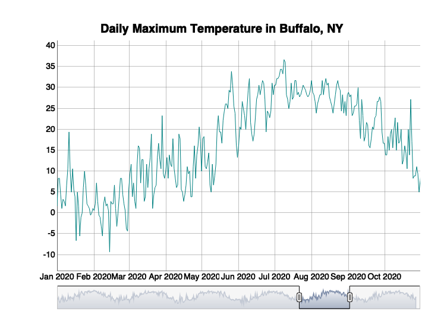

Case Study 12:
================
Wei Liu
November 30, 2021

# Load needed packages

``` r
library(dplyr)
library(ggplot2)
library(ggmap)
library(htmlwidgets)
library(widgetframe)
library(tidyverse)
library(rnoaa)
library(xts)
library(dygraphs)
```

# Download the daily weather data

``` r
d=meteo_tidy_ghcnd("USW00014733",
                   date_min = "2016-01-01", 
                   var = c("TMAX"),
                   keep_flags=T) %>% 
   mutate(date=as.Date(date),
          tmax=as.numeric(tmax)/10) #Divide the tmax data by 10 to convert to degrees.
```

# Create the dynamic graph

``` r
# Convert d into an xts time series object using xts()
dxts <- xts(x = d$tmax, order.by=d$date)
# Use dygraph() to draw the plot
dygraph(dxts, main="Daily Maximum Temperature in Buffalo, NY") %>%
  dyRangeSelector(dateWindow = c("2020-01-01", "2020-10-31")) 
```

<!-- -->
